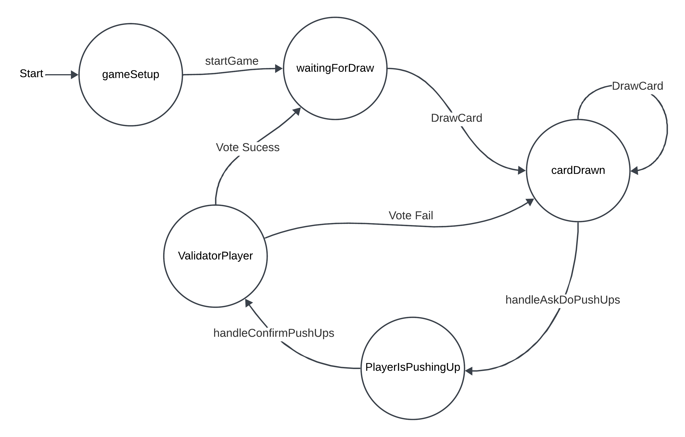
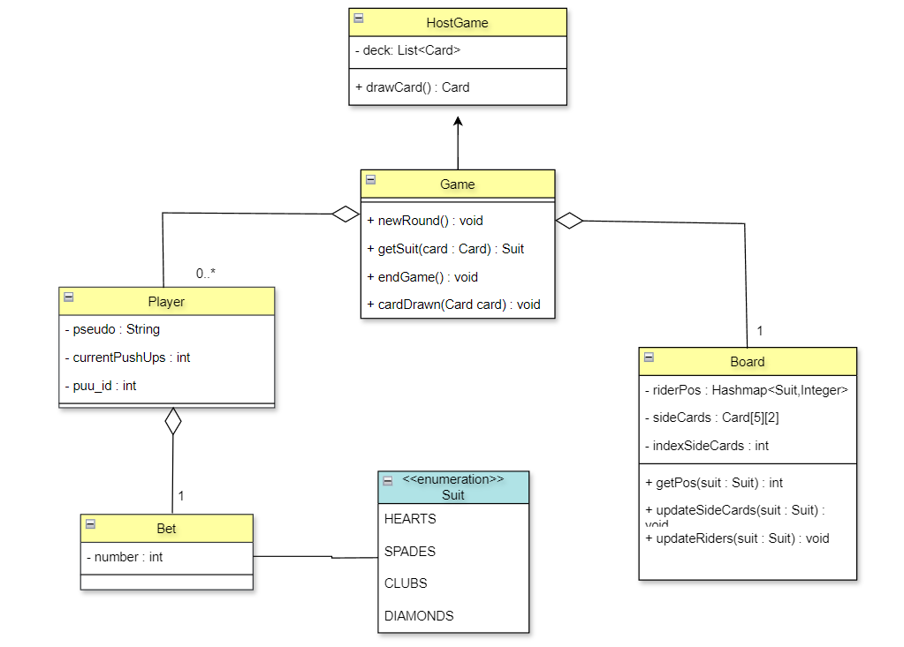

# Technical Review

## Table of Contents

- [Introduction](#introduction)
- [Overall Architecture](#overall-architecture)
- [View](#view)
- [ViewModel](#viewmodel)
- [Model](#model)
- [Network Payloads](#network-payloads)
- [Validation System of the real live actions](#validation-system-of-the-real-live-actions)

## Introduction

This document is a technical review of the project `PPM (Proximity Pushups Monsters) for Android`. It aims to explain a detailled summury of the implementation choices made during the development of the project. The project is part of the course `INFO4` at `Polytech Grenoble` in the `2023-2024` school year.

## Overall Architecture
We worked with an MVVM architecture. We will explain the different parts of the architecture in the following sections, but for now, here is a simple diagram that represents the overall archtiecture.


- View : The view regroup the XML files that represent the visual part of the application and the activities that manage the interactions with the user.

- ViewModel : The ViewModel manage the communication between the View and the Model, and finally the payloads treatement (sending & treating). Most of the logic of the application is in this part.

- Model : The Model is here to deal with the game logic and data. It is the part that contains the game main rules and the data that the game needs to work.

- ConnectionService (from NearbyConnection): The ConnectionService is an object that represents the network interface of the application. We will not detail this part in this document because it's not made by us, but you can find more information about it in the [Google Nearby Connections API documentation](https://developers.google.com/nearby/connections/overview).

## View
TODO

## ViewModel
For the sake of this project, our ViewModel (`ViewModelPMU`) is an abstract class that has two subclasses :
- `ViewModelHost`
- `ViewModelClient`

These two classes have the same goal, while being implemented each in their own specific way. 


### ViewModelHost
The host ViewModel is the one that will manage the game and the connection with the clients. It will be the one that will start the game, manage the bets, and the game board. It will also be the one that will send the payloads as instruction to the clients.

He's acting like a server AND like a client in a lot of way.

He's the one that that will manage the game logic and define the what is legal and what is not.

It's main goal is to checking the legality of a received payload by using a state machine and then to apply the action if it's legal.

State Machine in the ViewModelHost :
 
Each state only allows some specific actions to be done. If an action is not allowed in the current state, the payload will be ignored.

This system avoid having to deal with concurrency problems and make the code more readable and maintainable.

At the end, of each main event (such as ended vote, card drawn, etc), the host will send a payload to the clients to inform them of the new state of the game.

the action made by the host will go through the same process as the clients' actions but all locally until the confirmation.

### ViewModelClient
The client ViewModel always communicate only with the host. It will send the payloads to the host and wait for the host to send back the confirmation of the action to apply the action locally.

For this reason, he's not managing the legality of actions, but only the connection and the payloads that he has to handle. However, when the confirmation of the host is received, the client will apply the action locally by using the same action as the host. 

Therefore, the game model *nearly* the same for the host and the clients (the only difference is that the hostGame has a function draw a new card from the deck).

## Model 

Here is the class diagram of the model part of the application.


The Model part is really basic and is only here to manage the game logic and the data that the game needs to work. 

There only two thing that is worth to mention :

### GameHost
The Game representation has a special implementation for the Host.
It's because the host is the only one that can draw a card from the deck.
Therefore, the `drawCard` method is only implemented in the `GameHost` class and he's the only one that has a deck of cards stored locally. `drawCard` does not directly impact the game, to affect the change on have to call the `cardDrawn` method that is already here in the `Game` class.

### Client side representation
The make the code easier to work with, the game is stored on the client side as well of the host side. For this reason, the Game is only sent entirely to the clients when the betting phase starts. 

This feature allows the clients to have a local access to the game data and to be able to display the game board and the cards easily.

This also implies that to maintain a coherent game state on each device, the functions of the game model are called on each device when the host sends a payload to the clients.

This is the main principle of the ViewModel, to apply the actions locally when the host sends the confirmation of the action.

## Network Payloads 
The payload system already exists in the Nearby Connections API. 
The only remaining questions are how to manage the payloads in the ViewModel.
### Representation
Data will be represented using a json consistant format.
This offers a simple way to represent data and to parse it while keeping a human-readable format.
It also allows to easily add new actions and parameters to the protocol.
The json format will be as follows:
```json
{
    "action": "<ACTION>",
    "sender": "<HOST | CLIENT>"
    "params": {
        "<PARAM1>": "<VALUE1>",
        "<PARAM2>": "<VALUE2>",
        ...
    }
}
```

*Exemple* for a `VOTE` action:
```json
{
    "action": "VOTE",
    "sender": "HOST",
    "params": {
        "puuid": "A39BH49G",
        "vote": true
    }
}
```
*There is no need to send the `sender` field as it is implicit in the connection, it is only used for a debug purpose*

Lastly, some more complex objets needs to be transfered for some specific actions (`GAME_START`, `PLAYER_LIST`, etc).
For these cases, each object that needs to be transfered will have to implement the `Jsonizable` interface.
This interface will have two methods:
- `toJson()` : that will return the json representation of the object
- `fromJson(JSONObject json)` : that will return the object from the json representation

All of the actions and parameters are defined as constants to avoid any typo errors during development.

### Sending
There is not much to say about sending the payloads, as it is just using the `sendPayload` method from the Nearby Connections API.

However, We've made an easy way for building the payloads in the ViewModel.

The `PayloadMaker` class. 

By using this class we can create in a more readable way the payloads that we want to send.

Exemple :
```kotlin
// Generate a payload for a vote
val payload : Payload = PayloadMaker.createPayloadRequest(Action.VOTE, Sender.CLIENT)
    .addParam("puuid", "A39BH49G")
    .addParam("vote", true)
    .toPayload()

// Send the 'vote' payload
nearbyConnectionClient.sendPayload(payload)
```

### Treatment
The first step in treatment of the arriving payloads is done in the `onPayloadReceived` method of the `NearbyConnectionClient` class.
It's just transforming the payload into a string and then into a JSONObject and then, it calls the `onPayloadReceived` method **OF THE VIEW MODEL**.

Here's an exemple of how the payload are treated
```kotlin
override fun onPayloadReceived(endpointId: String, paquet: JSONObject) {
    val sender = paquet.get(Sender.SENDER) as String

    val params: JSONObject = paquet.get(Param.PARAMS) as JSONObject

    when(paquet.get(Action.ACTION)){
        Action.PLAYER_USERNAME -> {
            val name: String = params.get(Param.PLAYER_USERNAME) as String
            handlePlayerUsername(endpointId, name)
        }
        Action.BET -> {
            val puuid = params.get(Param.PUUID) as String
            val jsonBet: JSONObject = params.get(Param.BET) as JSONObject
            val bet: Bet = Bet.fromJson(jsonBet)
            handleBet(puuid, bet)
        }
        ... // Other actions treatement
    }
}
```

## Validation System of the real live actions

To validate IRL actions such as `player X as done a pushup`, we've implemented a simple system that let the players vote to validate if the action was done or not by player X.

The majority of the votes will decide if the action is validated or not.

This approach is inspired by the system of Blockchain and the consensus that is used to validate a block, but at a smaller scale because our system is not critical.

It's composed of 4 steps :
- The player that has done the action send a payload to the host to inform him that he has done the action.
- The host will send a payload to all the clients to inform them that player X has done the action and that they have to vote.
- The clients will send a payload to the host to inform him of their vote.
- The host will wait for all the votes and then will send a payload to all the clients to inform them (and himself) of the result of the vote.