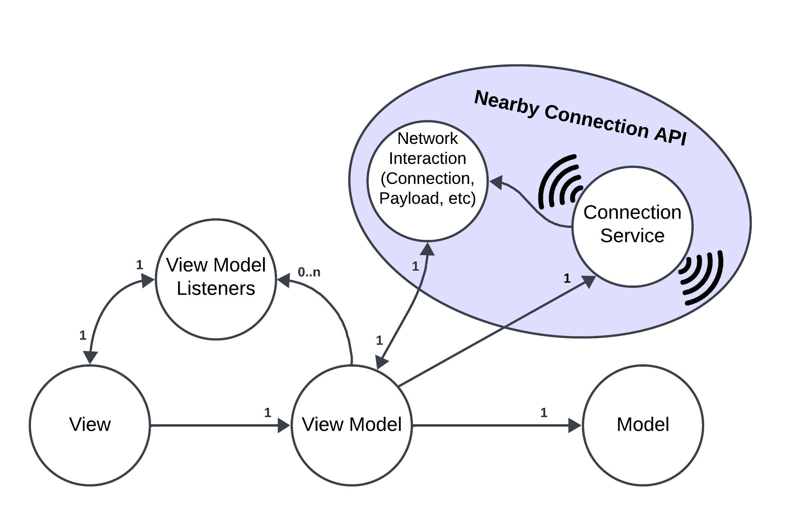

# Technical Review

## Table of Contents

- [Introduction](#introduction)
- [Overall Architecture](#overall-architecture)
- [View](#view)
- [ViewModel](#viewmodel)
- [Model](#model)

## Introduction

This document is a technical review of the project `PPM (Proximity Pushups Monsters) for Android`. It aims to explain a detailled summury of the implementation choices made during the development of the project. The project is part of the course `INFO4` at `Polytech Grenoble` in the `2023-2024` school year.

## Overall Architecture
We worked with an MVVM architecture. We will explain the different parts of the architecture in the following sections, but for now, here is a simple diagram that represents the overall archtiecture.

- View : The view regroup the XML files that represent the visual part of the application and the activities that manage the interactions with the user.

- ViewModel : The ViewModel manage the communication between the View and the Model, and finally the payloads treatement (sending & treating). Most of the logic of the application is in this part.

- Model : The Model is here to deal with the game logic and data. It is the part that contains the game main rules and the data that the game needs to work.

- ConnectionService (from NearbyConnection): The ConnectionService is an object that represents the network interface of the application. We will not detail this part in this document because it's not made by us, but you can find more information about it in the [Google Nearby Connections API documentation](https://developers.google.com/nearby/connections/overview).

## View
TODO

## ViewModel
TODO

## Model
TODO

## ???
